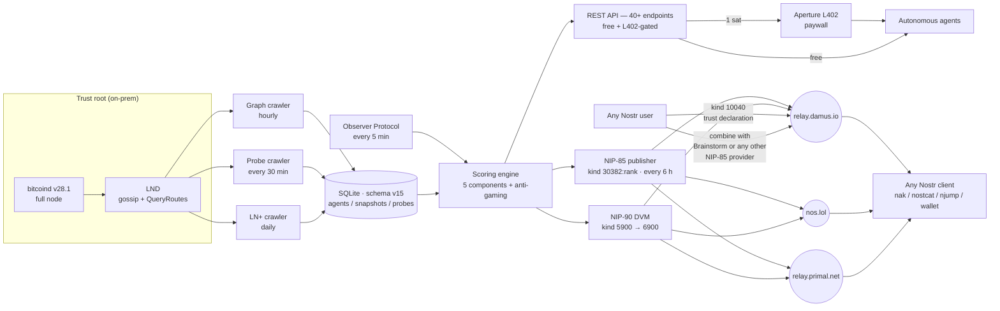

# SatRank — Impact Statement

**WoT-a-thon 2026 Submission — NIP-85 Excellence category**

*Route reliability for Lightning payments. Built for the agentic economy.*

---

## The Problem

The Lightning Network is a public good for instant Bitcoin payments — but from an agent or wallet's point of view, it's a minefield.

- **~60 % of Lightning nodes in the public graph are phantoms.** They advertise channels in gossip but fail to route payments. Some are offline. Some are under-provisioned. Some never actually had liquidity. A naive pathfinder treats them as valid hops and burns retries. The exact rate varies probe-to-probe and is published live by `/api/stats` (`phantomRate`), computed as `1 - verifiedReachable / nodesProbed` over the 13,913 active Lightning nodes SatRank tracks.
- **Gossip data is untrusted by construction.** A node can lie about its fees, its balance, its capacity. The only way to know if a hop actually works is to probe it — but probing at scale is expensive and slow if you do it from inside a single wallet.
- **There is no shared reliability oracle.** Every wallet rediscovers the same failing nodes. Every agent retries the same routes. Every payment that could have been one-shot becomes a retry loop.

For humans, this manifests as 30 % payment failure rates on first try. For autonomous agents paying for APIs, data, or other agents over L402, it's worse: a failed payment means a wasted compute cycle, a missed SLA, or a retry loop that blows the budget.

**The Lightning Network needs a trust oracle. SatRank is it.**

---

## The Solution

SatRank is a trust oracle for Lightning Network payments. Before each payment, an agent queries SatRank for a GO / NO-GO decision — one request, one answer, 1 sat via L402.

Under the hood, SatRank runs a full-stack observability pipeline:

- **bitcoind v28.1 full node** — UTXO validation for the Lightning graph. Migrated from Neutrino on 2026-04-07 for authoritative channel capacity and peer discovery.
- **LND** — gossip ingestion, peer discovery, probe routing.
- **Probe routing** — every 30 minutes, SatRank probes the reachable graph from its own node, recording reachability, latency, and hop counts. That's roughly ~260,000 probes per 24 h (see live `/api/stats.probes24h`).
- **Channel and fee snapshots** — every hour, captures topology and fee structure to detect churn and volatility.
- **5-factor scoring** — volume, reputation, seniority, regularity, diversity. Composite score 0-100 with anti-gaming (mutual-loop detection, 3-hop and 4-hop cycle BFS, mandatory minimum age for attestations).
- **Distribution via Nostr (NIP-85)** — every 6 hours, scores are signed and published to three canonical relays as kind `30382:rank` assertions. ~2,400 nodes per cycle (score ≥ 30). Zero platform lock-in.
- **Real-time queries via DVM (NIP-90)** — any agent can publish a kind 5900 trust-check job and receive a signed kind 6900 response in seconds, with on-demand probing for unknown nodes.

SatRank is the answer to *"can this Lightning node actually route my payment, right now?"* — answered once, by a neutral party, on Nostr, in the open.

---

## Architecture



Every layer is reproducible from the code in [github.com/proofoftrust21/satrank](https://github.com/proofoftrust21/satrank). The `rank` tag is the canonical NIP-85 normalized-score tag; strict NIP-85 consumers read it without any SatRank-specific knowledge. Clients that want the richer signal read the component tags too.

---

## The Impact

### For Nostr users and the NIP-85 ecosystem

**SatRank is the first and only NIP-85 provider bridging the Lightning payment graph into the Web of Trust.**

Every other NIP-85 implementation (Brainstorm, wot-scoring, nostr-wot-sdk, nostr-wot-oracle, Vertex) scores Nostr social graph data: follows, mutes, zaps. That's valuable for content discovery and social filtering, but it's not what you need when you're about to make a payment.

A Nostr user looking to zap a content creator already has social trust signals. What they *don't* have is: "will this zap actually reach them, or will it fail at the first hop?" That's SatRank.

By publishing on the same NIP-85 relay infrastructure already used for social WoT, **SatRank composes with existing providers**. A wallet can query both social trust *and* payment reliability from the same relay connection, with no second pipeline, no second SDK, no second identity. Users declare SatRank as their trusted provider for `30382:rank` in a kind 10040 event and it plugs into the same trust-resolution flow any other NIP-85 provider uses.

**Combining SatRank and Brainstorm in a single kind 10040.** Brainstorm (NosFabrica's reference social-WoT service) also uses the canonical `rank` tag on its kind 30382 events, so a user can list both providers in the same declaration and the client resolves them in parallel:

```json
{
  "kind": 10040,
  "tags": [
    ["30382:rank", "e5272de914bd301755c439b88e6959a43c9d2664831f093c51e9c799a16a102f", "wss://relay.damus.io"],
    ["30382:rank", "5d11d46de1ba4d3295a33658df12eebb5384d6d6679f05b65fec3c86707de7d4", "wss://relay.damus.io"]
  ],
  "content": ""
}
```

The client fulfilling `30382:rank` for this user issues one `REQ { kinds:[30382], authors:[<brainstorm>, <satrank>] }` per relay and receives **both** providers' assertions in a single subscription — social trust for Nostr npubs from Brainstorm, Lightning payment reliability for Lightning pubkeys from SatRank — merged by the client with no SatRank-specific code. Each provider's events are distinguishable by the `d` tag: Brainstorm uses 64-hex Nostr pubkeys, SatRank uses 66-hex Lightning pubkeys (prefixed `02`/`03`).

**Verified live on 2026-04-09:** Brainstorm's kind 30382 events (author `e5272de9…a102f`) are present on **2 of 3** SatRank canonical relays — `wss://relay.damus.io` and `wss://nos.lol`. A client subscribed to either of those relays receives both providers' `rank` assertions in one round trip today, with no configuration beyond the shared relay URL. Brainstorm also publishes on its own dedicated relay `wss://nip85.brainstorm.world`, which a client can add to its relay list to cover `wss://relay.primal.net`-only users. This is NIP-85's interoperability by design — SatRank exercises it end-to-end.

### For autonomous agents

The agentic economy runs on small, frequent payments between machines. Every wasted payment is a wasted compute cycle; every retry is latency that eats into SLAs. SatRank gives agents a pre-flight check before they commit to a route, and its `/api/decide` endpoint turns "will this payment probably work" from a multi-second probe into a single sub-100 ms API call.

For a coding agent paying for an LLM API over L402, SatRank is the difference between "pay the provider instantly" and "retry three times, hit the budget cap, fail the task."

### For Lightning Network operators

A public, neutral reliability score creates an incentive to actually route payments well. Phantom nodes are invisible in today's landscape — there's no leaderboard of shame, no scoring that distinguishes real routing from gossip-only capacity claims. SatRank publishes a `rank` score every 6 hours for every active node above the threshold, and a phantom score punishes nodes that advertise capacity they can't deliver. Nodes have a reason to fix their liquidity, their uptime, and their fee stability, because the score is public.

### For Bitcoin UX

When a wallet can pre-filter routes through SatRank before constructing a path, the user experience stops being "retry 3 times, fail, get angry, fall back to on-chain." It becomes "pay, done, 300 ms." That's the baseline Lightning was supposed to deliver. SatRank is a missing piece of that baseline.

---

## What no other project does

Five capabilities unique to SatRank in the 2026 NIP-85 / WoT / Lightning landscape:

1. **Only NIP-85 provider on the Lightning payment graph.** Every other implementation scores the Nostr social graph. SatRank bridges an entire orthogonal trust domain into NIP-85 without a new kind allocation.
2. **Proprietary phantom signal.** ~60 % of the Lightning graph is unreachable in routing on any given probe cycle, and SatRank's phantom detection is validated against a full bitcoind UTXO set — not a Neutrino / SPV approximation. No free explorer exposes this, and the live value is exposed in real time at `/api/stats`.
3. **Native L402 paywall on the `/api/decide` oracle endpoint.** 1 sat per personalized decision — a functioning crypto-native business model, not a theoretical monetization. Aperture reverse-proxies the gate.
4. **Closed feedback loop.** `decide → pay → report` — reports are free, weighted by the reporter's own score, and preimage-verified reports get a 2× weight bonus. Usage improves decisions, better decisions attract more usage.
5. **Survival score.** 7-day forward-looking prediction (stable / at_risk / likely_dead) derived from score trajectory, probe stability, and gossip freshness. No machine learning — deterministic, reproducible from the data in this repo.

---

## Reusable building block

SatRank is designed to be consumed piecewise by anyone, with zero lock-in:

- **Any Nostr client** can read kind `30382:rank` events without an SDK, an API key, or a Lightning payment.
- **The NIP-90 DVM** (kind 5900 → 6900) gives agents a signed real-time trust check over Nostr with zero account creation.
- **The MCP Server** exposes 12 tools (decide, ping, report, profile, verdict, batch verdicts, leaderboard, search, stats, movers, attestations, score) to any MCP-aware client. Listed on [glama.ai/mcp/servers](https://glama.ai/mcp/servers).
- **The open-source TypeScript SDK** reduces the decide → pay → report loop to a single `client.transact(…)` call.
- **L402 / 402index.io.** SatRank is listed on [402index.io](https://402index.io), discoverable alongside every other L402-enabled service.
- **OpenAPI spec** at `/api/openapi.json` and interactive Swagger UI at `/api/docs` for code generators and for the jury.

---

## NIP-85 Compliance

SatRank is compliant with NIP-85 at both layers of the protocol.

### Kind 30382 — Trusted Assertions (published)

- **Canonical `rank` tag** with normalized 0-100 score, consumable by strict NIP-85 clients with no SatRank-specific knowledge
- **SatRank-specific tags** published alongside for clients that want the richer signal: `verdict`, `reachable`, `survival`, `volume`, `reputation`, `seniority`, `regularity`, `diversity`, `alias`
- **Replaceable events** (same `d`-tag per Lightning node pubkey) so clients always see the latest
- **Three canonical relays**: `relay.damus.io`, `nos.lol`, `relay.primal.net`
- **Every 6 hours**, every active node with score ≥ 30, signed with a single service key. Most recent cycle: **2,424 events published** (logged `Nostr score publish complete published=2424 errors=0 relays=3`).
- Published via `src/nostr/publisher.ts`; see `src/tests/nostr.test.ts` for unit coverage.

**Scope extension note.** NIP-85's "User as Subject" is defined generically for a 32-byte pubkey. SatRank extends the semantics to Lightning node pubkeys (same secp256k1 format, different key space). The extension is honest and documented publicly on `satrank.dev/methodology` and in the project README; it bridges an entire domain (Lightning payment reliability) into the NIP-85 ecosystem without requiring a new kind allocation.

### Kind 10040 — Trusted Provider Declaration (discoverable)

- **Copy-paste ready documentation** for users to declare SatRank as their trusted provider for `30382:rank`, published in both `README.md` and the public `satrank.dev/methodology#declare-provider` page
- **Self-declaration script (`scripts/nostr-publish-10040.ts`)** ready to run: emits a kind 10040 from SatRank's service key that lists its own pubkey as the trusted provider for `30382:rank` on all three canonical relays. Clients then have an on-chain reference example they can query and copy.
- **Live 10040 circuit proof on the methodology page:** the page issues a REQ to each relay from the browser and renders whatever the relays return in real time. When the self-declaration is live, the jury sees the event IDs, timestamps, and raw tags. If the self-declaration has not been published yet, the widget honestly displays `0 events` — the same circuit code, the same relays, only the content differs. You can re-check on every page load or with the "Re-check" button.
- **Kind 0 service profile** with `name` / `about` / `website` / `nip05` per NIP-01 and NIP-85 Appendix 1 discovery flow, confirmed live on all three canonical relays (3/3 kind 0 events observed by `scripts/nostr-verify.ts` at submission time).

### Kind 5900 / 6900 — NIP-90 DVM (real-time)

- **DVM trust-check handler** subscribes to kind 5900 job requests with `["j", "trust-check"]` on all three canonical relays (logged `DVM handler info published` on every startup)
- On-demand `QueryRoutes` probing for nodes not in the cached snapshot, so the answer reflects the *live* graph, not a stale cache
- Free for anyone, no payment required

### NIP-05 verification

- `satrank@satrank.dev` resolves to the service pubkey via the `/.well-known/nostr.json` endpoint in `src/app.ts`, using the canonical relay list

### Live verification script

```bash
npx tsx scripts/nostr-verify.ts
```

Queries all three relays for kinds 0, 30382 and 10040, prints a per-relay summary, exits non-zero if any kind is missing. What the jury sees is what's on the network.

---

## Business model — sustainability

The freemium architecture is limpid and already profitable at the margin:

| Layer | Pricing | Role |
|---|---|---|
| **NIP-85 scores (kind 30382 on 3 relays)** | **free** | Distribution, adoption, composability with other NIP-85 providers |
| **NIP-05, NIP-90 DVM, `/api/ping`, `/api/agents/top`, `/api/stats`, `/api/health`** | **free** | Discovery, live reachability, public statistics |
| **`/api/decide` (personalized GO/NO-GO + pathfinding)** | **1 sat via L402** | Primary revenue — the personalized oracle call |
| **`/api/profile`, `/api/agent/:hash`, `/api/agent/:hash/verdict`, `/api/agent/:hash/history`, `/api/verdicts`** | **1 sat via L402** | Detailed queries — secondary revenue |
| **`/api/report`, `/api/attestations`** | **free** (API key for identity) | Closes the feedback loop — reports improve `P_empirical` in future decide responses |

Why it works:
- **Free NIP-85 scores fund adoption** — any Nostr client can embed SatRank trust into its UI for free. That drives awareness and kind 10040 declarations.
- **Paid decide funds infrastructure** — 1 sat per personalized query scales linearly with agent traffic. No ads, no VC, no seed round required to operate the oracle.
- **Free reports fund accuracy** — the feedback loop is the moat. The more agents report, the better `P_empirical` becomes, the more agents use the decide endpoint.

Sats flow in via `/api/decide` (Aperture L402 gate), out to the Hetzner infrastructure. The margin is positive at any non-zero sustained call rate and improves with scale.

---

## Metrics (as of 2026-04-09)

Stable infrastructure numbers are pinned here. Entries tagged **(live)** are dynamic — they are pulled from [/api/stats](https://satrank.dev/api/stats) on every page load of the landing page and drift probe-to-probe. The authoritative, always-current value is whatever `/api/stats` returns when the jury opens it; the ranges below are the envelope observed at submission time.

| Metric | Value |
|---|---|
| Active Lightning nodes tracked | **13,913** |
| Stale (90+ days, excluded from scoring) | **4,225** |
| Phantom node share (unreachable in routing) | **~60 %** (live · typical range 60-62 %) |
| Verified reachable nodes | **~5,300-5,500** (live · `/api/stats.verifiedReachable`) |
| Total channels (UTXO-validated) | **~88,950** (live · `/api/stats.totalChannels`) |
| Network capacity (validated) | **~9,630 BTC** (live · `/api/stats.networkCapacityBtc`) |
| Probes executed / 24 h | **~255,000-265,000** (live · `/api/stats.probes24h`, 24 h rolling) |
| Scored nodes published via NIP-85 per cycle | **~2,400** (score ≥ 30, last cycle: 2,424) |
| Publishing frequency | every 6 hours |
| DVM response time (warm cache) | sub-100 ms |
| DVM response time (cold probe) | 1–3 seconds |
| Probe cycle coverage | full graph, every 30 minutes |
| Score snapshots stored | **921,968** (retained 45 days, chunked purge) |
| Scoring components | **5** (volume, reputation, seniority, regularity, diversity) |
| Verdict SAFE threshold (post-v15 calibration) | **score ≥ 47** |
| Anti-gaming checks | mutual-loop, 3-hop BFS, 4-hop BFS, attester min-age, source concentration |
| Bitcoin trust root | **bitcoind v28.1** full node (migrated from Neutrino on 2026-04-07) |
| Nostr relays published to | **3** canonical (damus.io, nos.lol, primal.net) |
| Canonical NIP-85 result tag | **`rank`** (alongside `score` and 5 component tags) |
| Test suite | **464 tests / 34 files**, all green on submission commit |
| Database schema version | **v15** |

---

## Technology

- **TypeScript** strict mode, Node 22
- **Express** — REST API, 40+ endpoints, NIP-05 handler
- **better-sqlite3** — embedded database, WAL mode, chunked retention cleanup for time-series tables
- **bitcoind v28.1** full node + **LND** for trust root and probing
- **nostr-tools** — NIP-85 publishing (kind 30382 + 10040), NIP-90 DVM (kind 5900 → 6900), NIP-01 event signing
- **zod** — input validation at every API boundary
- **pino** — structured logging
- **Docker Compose** — api + crawler containers with cap-drop-ALL, read-only filesystem, tmpfs, and liveness healthchecks
- **L402 / Aperture** — paid gate for `/api/decide` (the 1-sat-per-query oracle endpoint)
- **vitest** — 464 unit + integration tests across 34 files, all green on the submission commit

---

## Beyond the Hackathon

SatRank isn't a hackathon project, it's infrastructure. The post-submission roadmap:

- **Open the DVM to any agent identity.** Today the DVM responds free; future versions may introduce per-caller rate limiting via NIP-98 HTTP auth + L402 for high-volume consumers while keeping single queries free.
- **Per-component NIP-85 keys.** The spec says providers MUST use different service keys per algorithm. SatRank currently uses one key for the composite score; the next iteration will split `30382:volume`, `30382:reputation`, `30382:regularity`, etc. onto their own service keys so users can pick-and-choose components in their kind 10040.
- **Cross-signing with other NIP-85 providers.** SatRank's Lightning data is orthogonal to social WoT. A composite trust score that blends SatRank with Brainstorm / Vertex would give agents a unified "can I trust this npub AND can I pay them" decision in a single query. Interoperability is already in place via the shared relay layer; cross-signing is the natural extension.
- **Delegated signing for wallets.** A wallet signing thousands of kind 10040 entries for its power users shouldn't need to prompt for each; NIP-26 delegated signing + a batched UI would remove that friction.
- **Historical delta APIs on the `/api/agents/:hash/history` endpoint.** Now that the v15 scoring era is clean (pre-v15 snapshots purged 2026-04-09), the 7-day and 30-day deltas start fresh and become meaningful signals for trending nodes.

---

## Why SatRank Should Win the NIP-85 Excellence Prize

Three reasons:

1. **It's the only NIP-85 provider bridging the Lightning payment graph into the WoT ecosystem.** Every other implementation is a social-graph calculator. SatRank adds an entire orthogonal dimension of trust, and it does so through the existing NIP-85 relay infrastructure with zero new kinds or breaking changes. A client whose user lists both Brainstorm and SatRank in their kind 10040 and subscribes to `wss://relay.damus.io` or `wss://nos.lol` receives both providers' `rank` assertions in a single `REQ { kinds:[30382], authors:[<brainstorm>, <satrank>] }` call — verified live on 2026-04-09.

2. **It's the only Lightning trust oracle that's Nostr-native from day one.** Not "we have a REST API and also we tweet the scores." The Nostr relays are the canonical distribution layer; NIP-05 verification, NIP-85 publishing (30382 + 10040), and NIP-90 DVM all share the same keypair and the same relay list.

3. **It's production infrastructure, not a demo.** 13,913 active nodes, ~89,000 validated channels, ~9,630 BTC validated capacity, ~260,000 probes per 24 h, 921,968 score snapshots, ~2,400 NIP-85 events published per cycle, backup + recovery path, heartbeat healthchecks, 464-test typed suite, and a Hetzner deployment behind nginx with L402 paid gates on the personalized endpoint. All open source, all reproducible — live values at [`/api/stats`](https://satrank.dev/api/stats).

The Lightning Network has been waiting for its reliability oracle. NIP-85 has been waiting for its first real-world protocol bridge. SatRank is both.

---

**Project:** [satrank.dev](https://satrank.dev)
**NIP-05:** `satrank@satrank.dev`
**Service pubkey:** `5d11d46de1ba4d3295a33658df12eebb5384d6d6679f05b65fec3c86707de7d4`
**Code:** [github.com/proofoftrust21/satrank](https://github.com/proofoftrust21/satrank)
**License:** AGPL-3.0
