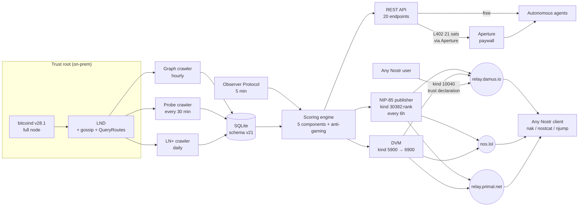

# SatRank

**Route reliability for Lightning payments. Built for the agentic economy.**

SatRank is a trust oracle for the Lightning Network. Before each payment, an agent queries SatRank for a GO/NO-GO decision: one request, one answer, 1 sat effective via L402 (21 sats = 21 requests).

- Backed by a full **bitcoind v28.1** node + **LND**, not Neutrino or gossip. Every channel capacity is UTXO-validated.
- Tracks **~13,900 active Lightning nodes** (schema v21, post-migration), probes them every 30 minutes at multiple amount tiers, publishes trust assertions on Nostr every 6 hours.
- **61 %** of the Lightning graph is unreachable in routing ("phantom nodes"). The exact rate varies probe-to-probe and is published live by `/api/stats`. SatRank tells you which nodes are actually alive.
- First **NIP-85** provider bridging the Lightning payment graph into the Web of Trust. Every other NIP-85 implementation scores the Nostr social graph. SatRank scores who you can actually pay.

## Quick Start: consume SatRank trust assertions in 3 steps

Any Nostr client can read SatRank's Lightning trust scores without an SDK, an API key, or a Lightning payment:

```bash
# 1) Install nak -- the command-line Nostr utility (https://github.com/fiatjaf/nak)
go install github.com/fiatjaf/nak@latest

# 2) Fetch the 5 latest trust assertions for Lightning nodes
nak req -k 30382 -a 5d11d46de1ba4d3295a33658df12eebb5384d6d6679f05b65fec3c86707de7d4 \
  --limit 5 wss://relay.damus.io

# 3) The returned events include a `rank` tag (0-100 normalized trust score),
#    a `verdict` tag (SAFE/RISKY/UNKNOWN), a `reachable` tag, five component
#    scores, an alias, and the Lightning pubkey in the `d` tag. Parse any of
#    them with jq or your favorite Nostr client.
```

Prefer HTTP? SatRank also exposes the same data via a free `GET /api/agents/top` endpoint and a paid `POST /api/decide` endpoint gated by L402 (21 sats = 21 requests, 1 sat/request effective).

## Agent workflow: screen, route, decide

The recommended pattern for autonomous agents making payments: screen many, pick the best route, then decide on the winner.

**Step 1: Screen.** `POST /api/verdicts` with up to 100 target hashes in a single request. Returns score, verdict (SAFE/RISKY/UNKNOWN), and confidence for each target. 1 request from your L402 balance.

**Step 2: Route.** `POST /api/best-route` with the SAFE subset from step 1. Returns the top 3 candidates sorted by a composite rank (score, hops, fees). All pathfinding runs in parallel. 1 request.

**Step 3: Decide.** `POST /api/decide` on the top candidate from step 2. Returns GO/NO-GO, 5 probability components, personalized pathfinding from your position (or from your wallet provider's hub via `walletProvider`), risk profile, survival prediction, fee stability, and max routable amount. 1 request.

```bash
# Step 1: Screen 100 candidates (1 request from L402 balance)
curl -X POST https://satrank.dev/api/verdicts \
  -H "Content-Type: application/json" \
  -d '{"hashes": ["<hash1>", "<hash2>", "...up to 100"]}'

# Step 2: Find best route among SAFE candidates (1 request)
curl -X POST https://satrank.dev/api/best-route \
  -H "Content-Type: application/json" \
  -d '{"targets": ["<safe1>", "<safe2>", "..."], "caller": "<your-hash>", "amountSats": 50000}'

# Step 3: Decide on the winner (1 request)
# walletProvider tells SatRank to compute pathfinding from your wallet's hub node
curl -X POST https://satrank.dev/api/decide \
  -H "Content-Type: application/json" \
  -d '{"target": "<best-route-hash>", "caller": "<your-hash>", "walletProvider": "phoenix"}'
```

| Step | Endpoint | Latency | Cost | Returns |
|------|----------|---------|------|---------|
| Screen | `POST /api/verdicts` | ~250 ms | 1 request | verdict + score + confidence per target |
| Route | `POST /api/best-route` | ~100 ms | 1 request | top 3 candidates by composite rank |
| Decide | `POST /api/decide` | ~150 ms | 1 request | GO/NO-GO + success rate + pathfinding + fee volatility |
| **Total** | | **~500 ms** | **3 requests** | **Fully informed decision from 100 candidates** |

**Pricing:** 21 sats = 21 requests via L402 (1 sat/request effective). Each paid endpoint consumes 1 request from the token balance. The `X-SatRank-Balance` header tracks remaining requests. 7 complete workflows per token.

**Concrete example:** Agent has 100 candidate nodes for a payment. Screen returns 42 SAFE, 31 UNKNOWN, 27 RISKY in ~250 ms. Best-route narrows to the top 3 by route quality in ~100 ms. Decide on the winner returns GO with rate=0.987, targetFeeStability=0.91, maxRoutableAmount=100000 in ~150 ms. Total: 3 requests, under 1 second.

### Cost vs. value

An agent making 1,000 payments/day spends ~3,000 sats/day on oracle fees. One avoided failed payment saves more: routing fees are lost on failure, the HTLC timeout locks capital for 30-60 seconds, and the retry adds another round-trip. At scale, the oracle pays for itself many times over.

| Volume | Daily oracle cost | Break-even |
|--------|-------------------|------------|
| 100 payments/day | ~300 sats | 1 avoided failure |
| 1,000 payments/day | ~3,000 sats | 1 avoided failure |
| 10,000 payments/day | ~30,000 sats | 1 avoided failure |

### Positional pathfinding

Most AI agents don't run their own LND node. They pay via wallet providers (Phoenix, WoS, Strike, etc.) and don't know their position in the graph. Without positional context, SatRank computes P_path from its own node -- a poor proxy for the agent's actual route quality.

Pass `walletProvider` in `/api/decide` and SatRank computes pathfinding from the provider's hub node instead:

```json
{ "target": "<hash>", "caller": "<hash>", "walletProvider": "phoenix" }
```

Supported providers: `phoenix`, `wos`, `strike`, `blink`, `breez`, `zeus`, `coinos`, `cashapp`. Alternatively, pass `callerNodePubkey` with any Lightning pubkey to use as the pathfinding source.

Impact: a Phoenix agent querying Binance gets 1-hop / 0-fee pathfinding (P_path=0.97) instead of a null fallback (P_path=0.50). The successRate jumps from 0.74 to 0.98.

## Architecture



The full path: **bitcoind → LND → crawlers/probes → scoring engine → NIP-85 publisher + L402 API + DVM → 3 relays / HTTP clients / autonomous agents.** Every layer is reproducible from the code in this repo.

## Current network snapshot (2026-04-09)

| Metric | Value | Source |
|---|---|---|
| Active Lightning nodes indexed | **~13,900** | `/api/stats` `totalAgents` |
| Stale (not seen 90+ days, excluded from scoring) | **4,225** | `/api/stats` |
| Phantom rate (unreachable in routing) | **61 %** (live) | `/api/stats` `phantomRate` |
| Verified reachable | **~5,300-5,500** (live) | `/api/stats` `verifiedReachable` |
| Total channels | **~88,950** (live) | `/api/stats` `totalChannels` |
| Network capacity (validated) | **~9,630 BTC** (live) | `/api/stats` `networkCapacityBtc` |
| Probes executed / 24 h | **~650,000** (live · 24 h rolling) | `/api/stats` `probes24h` |
| NIP-85 events published per cycle | **~5,000** (score ≥ 30) | crawler log |
| Score snapshots stored | **921,968** | `sqlite3 … 'SELECT COUNT(*) FROM score_snapshots'` |
| Tests (vitest) | **526 / 40 files** green | `npm test` |
| Schema version | **v21** | `SELECT * FROM schema_version` |

Numbers are pulled live from `/api/stats` (free endpoint, no auth). The landing page at [satrank.dev](https://satrank.dev) renders them client-side on every visit.

## Scoring Algorithm

Composite score 0-100 computed from 5 weighted components:

| Component | Weight | Measures |
|---|---|---|
| **Volume** | **25 %** | Channels x capacity blend (50/50 log scale, ref 500 ch / 50 BTC) or verified transactions (log) |
| **Reputation** | **30 %** | 5 sub-signals: sovereign PageRank (100% coverage), peer trust, routing quality, capacity trend, fee stability |
| **Seniority** | **15 %** | Days since first seen, exponential growth with 2-year half-life |
| **Regularity** | **15 %** | Multi-axis consistency over 7 d (uptime 70 % + latency stability 20 % + hop stability 10 %) |
| **Diversity** | **15 %** | Unique peers (log, ref 500) or unique counterparties (log) |

Multiplicative modifiers: verified-tx x1.0-1.10, LN+ ratings x1.0-1.05, probe penalty x0.65-0.90 (graduated by cause). Popularity bonus removed (gameable).

**Anti-gaming:**
- Mutual attestation loop detection (A↔B) with 95 % penalty
- Circular cluster detection (A→B→C→A) with 90 % penalty
- Extended cycle detection via BFS (up to 4 hops) with 90 % penalty
- Minimum 7-day seniority required to attest
- Attester score weighting (PageRank-like recursion)
- Attestation source concentration penalty

**Verdict thresholds** (`GET /api/agent/{hash}/verdict`): SAFE >= 47 (post-v19 recalibration, unchanged in v20), UNKNOWN 30-46, RISKY < 30 or critical flags. See `public/methodology.html` for the full rationale.

## API

### Decision API (primary interface for agents)

```bash
# GO / NO-GO decision with success probability (L402, 1 request from balance)
curl -X POST https://satrank.dev/api/decide \
  -H "Content-Type: application/json" \
  -d '{"target": "<hash>", "caller": "<your-hash>"}'

# Report transaction outcome (free -- no L402)
curl -X POST https://satrank.dev/api/report \
  -H "Content-Type: application/json" \
  -H "X-API-Key: <key>" \
  -d '{"target": "<hash>", "reporter": "<your-hash>", "outcome": "success"}'

# Agent profile with reports, uptime, rank
curl https://satrank.dev/api/profile/<hash>

# Real-time reachability check (free)
curl https://satrank.dev/api/ping/<ln-pubkey>
curl "https://satrank.dev/api/ping/<ln-pubkey>?from=<your-ln-pubkey>"
```

### Score & Verdict API

```bash
curl https://satrank.dev/api/agent/<hash>/verdict
# Returns: SAFE / RISKY / UNKNOWN with confidence, flags, risk profile, personalized pathfinding
```

### Other endpoints

| Method | Endpoint | Purpose | Cost |
|---|---|---|---|
| POST | `/api/decide` | GO/NO-GO with success probability + pathfinding + fee volatility + max routable amount | 1 req |
| POST | `/api/best-route` | Batch pathfinding for up to 50 targets, returns top 3 by composite rank | 1 req |
| POST | `/api/report` | Report transaction outcome (weighted by reporter score) | free (API key) |
| GET | `/api/profile/:id` | Full agent profile with reports, uptime, rank | 1 req |
| GET | `/api/ping/:pubkey` | Real-time reachability (QueryRoutes live) | free |
| GET | `/api/agent/:hash` | Detailed score + evidence | 1 req |
| GET | `/api/agent/:hash/verdict` | SAFE/RISKY/UNKNOWN + flags + risk profile | 1 req |
| GET | `/api/agent/:hash/history` | Score snapshots with deltas | 1 req |
| GET | `/api/agent/:hash/attestations` | Received attestations (list) | 1 req |
| GET | `/api/agents/top` | Leaderboard by score | free |
| GET | `/api/agents/movers` | Top 7-day movers | free |
| GET | `/api/agents/search?alias=…` | Search by alias | free |
| POST | `/api/verdicts` | Batch verdicts for up to 100 hashes | 1 req |
| POST | `/api/attestations` | Submit attestation | free (API key) |
| GET | `/api/health` | DB status, schema version, agents indexed, uptime | free |
| GET | `/api/stats` | Network statistics | free |
| GET | `/api/docs` | Interactive Swagger UI | free |
| GET | `/api/openapi.json` | OpenAPI 3 spec | free |
| GET | `/.well-known/nostr.json` | NIP-05 handler (satrank@satrank.dev) | free |

Live Swagger UI: [satrank.dev/api/docs](https://satrank.dev/api/docs).

## Nostr Integration

SatRank is a [NIP-85](https://github.com/nostr-protocol/nips/blob/master/85.md) Trusted Assertion provider. It publishes kind `30382:rank` assertions for Lightning Network nodes, declares itself as a provider via kind `10040`, operates a NIP-90 DVM for real-time trust checks, and exposes NIP-05 verification.

**NIP-85 scope note.** NIP-85's "User as Subject" is defined generically for a 32-byte pubkey; SatRank extends the semantics to Lightning node pubkeys (same secp256k1 format, different key space). The canonical `rank` tag is published alongside SatRank-specific tags so strict NIP-85 consumers can read assertions without SatRank-specific knowledge, while clients that want the richer signal can read the component tags too.

### Kind 30382: Trusted Assertions (published)

- `rank` (0-100 normalized trust score), the canonical NIP-85 tag
- `verdict` (SAFE/RISKY/UNKNOWN)
- `reachable` (boolean, from live probes)
- `survival` (stable / at_risk / likely_dead)
- five component scores: `volume`, `reputation`, `seniority`, `regularity`, `diversity`
- `alias` and the Lightning pubkey in the `d` tag (replaceable events)

**Frequency:** every 6 hours. Nodes published per cycle: ~5,000 (score ≥ 30 on ~13,900 active).

**Event format:**
```json
{
  "kind": 30382,
  "tags": [
    ["d", "<lightning_pubkey>"],
    ["n", "lightning"],
    ["rank", "94"],
    ["alias", "Kraken"],
    ["score", "94"],
    ["verdict", "SAFE"],
    ["reachable", "true"],
    ["survival", "stable"],
    ["volume", "100"],
    ["reputation", "79"],
    ["seniority", "87"],
    ["regularity", "100"],
    ["diversity", "100"]
  ],
  "content": ""
}
```

**Query from any Nostr client:**
```
["REQ", "satrank", {"kinds": [30382], "authors": ["5d11d46de1ba4d3295a33658df12eebb5384d6d6679f05b65fec3c86707de7d4"]}]
```

### Dual publishing: strict NIP-85 + Lightning-indexed extension

SatRank publishes kind 30382 events in **two indexed namespaces** to serve both the letter and the spirit of NIP-85:

- **Lightning-indexed (extension).** `d = <66-char Lightning node pubkey>`, the default stream. Emitted every 6 hours for every active node with score ≥ 30 (~5,000 events per cycle). This extends NIP-85's "User as Subject" semantics from 32-byte Nostr pubkeys to 66-byte Lightning pubkeys (same secp256k1, different key space). It's the stream that makes the Lightning payment graph queryable via NIP-85 for the first time.
- **Nostr-indexed (strict).** `d = <64-char Nostr pubkey>`, strictly conformant to NIP-85's subject-key requirement. Emitted for every (Nostr operator, Lightning node) pair SatRank can verify cryptographically.

**How we build the mapping.** NIP-57 zap receipts (kind 9735) contain the recipient's Nostr pubkey in the `p` tag and the paid invoice in the `bolt11` tag. The BOLT11 invoice's destination (`payee_node_key`) is the Lightning node that settled the payment, cryptographically guaranteed by the invoice signature. Cross-referencing `p` and `payee_node_key` gives a verifiable `(nostr_pubkey, ln_pubkey)` tuple. The miner paginates backwards across 9 relays (`damus.io`, `nos.lol`, `relay.primal.net`, `relay.nostr.band`, `nostr.wine`, `relay.snort.social` and 3 others) via NIP-01 `until`-based pagination, walking up to 40 pages × 500 events per relay with a 90-day age wall.

**Latest production run (2026-04-10):** ~15,500 distinct zap receipts decoded across 9 relays with a 90-day age wall, **105 strict-NIP-85 events** published after all filters (score >= 30, not stale, custodian alias rejected, exactly 1 nostr pk per ln pk).

**Custodian filtering.** The same BOLT11 destination across many distinct Nostr pubkeys means a custodial wallet (Wallet of Satoshi, Alby, Minibits, …). SatRank drops any ln_pubkey paired with more than 1 distinct Nostr pubkey in the mining sample AND any node whose alias matches a known custodial/LSP pattern (`zlnd*`, `lndus*`, `*coordinator*`, `*.cash`, `zeus`, `alby`, `wos`, `cashu`, `minibits`, `phoenix`, `breez`, `muun`, `primal`, `nwc`, `fountain`, `wavlake`, `fedi`, `fewsats`, `lightspark`, `voltage`, `strike`, …). What remains is a conservative set of self-hosted operators.

**Commands:**

```bash
# 1) Mine zap receipts across the canonical relays (+ Primal cache), build the mapping
npx tsx scripts/nostr-mine-zap-mappings.ts
# → scripts/nostr-mappings.json

# 2) Preview the strict events that would be published from the mined mappings
DRY_RUN=1 DB_PATH=./data/satrank.db \
  npx tsx scripts/nostr-publish-nostr-indexed.ts

# 3) Publish for real (once you're happy with the preview)
NOSTR_PRIVATE_KEY=<hex> DB_PATH=./data/satrank.db \
  npx tsx scripts/nostr-publish-nostr-indexed.ts

# 4) One-shot self-declaration event: SatRank's own Nostr pk → SatRank's Lightning node
NOSTR_PRIVATE_KEY=<hex> DB_PATH=./data/satrank.db \
  npx tsx scripts/nostr-publish-self-declaration.ts
```

Both streams carry the same score payload (`rank`, `verdict`, `reachable`, `survival`, 5 components). A strictly-conformant NIP-85 client can filter on `"#d": ["<nostr_pubkey>"]` and get a score assertion without needing any SatRank-specific knowledge of the Lightning key space.

### Kind 10040: Trusted Provider Declaration

Any Nostr user can declare SatRank as their trusted provider for Lightning node trust assertions by publishing a kind 10040 event with one tag per (provider, relay) combo:

```json
{
  "kind": 10040,
  "tags": [
    ["30382:rank", "5d11d46de1ba4d3295a33658df12eebb5384d6d6679f05b65fec3c86707de7d4", "wss://relay.damus.io"],
    ["30382:rank", "5d11d46de1ba4d3295a33658df12eebb5384d6d6679f05b65fec3c86707de7d4", "wss://nos.lol"],
    ["30382:rank", "5d11d46de1ba4d3295a33658df12eebb5384d6d6679f05b65fec3c86707de7d4", "wss://relay.primal.net"]
  ],
  "content": ""
}
```

Multiple relay entries are independent; a client picks whichever relay is reachable. **You can combine SatRank with other NIP-85 providers in the same kind 10040 event.** For example, a client using Brainstorm ([NosFabrica/brainstorm](https://github.com/nosFabrica/brainstorm)) for social-graph trust assertions can add SatRank's row to the same 10040 declaration:

```json
{
  "kind": 10040,
  "tags": [
    ["30382:followRank", "<BRAINSTORM_PUBKEY>", "wss://relay.damus.io"],
    ["30382:rank",       "5d11d46de1ba4d3295a33658df12eebb5384d6d6679f05b65fec3c86707de7d4", "wss://relay.damus.io"]
  ],
  "content": ""
}
```

A client fulfilling `30382:rank` queries will then receive both providers' assertions in parallel (social trust from Brainstorm, Lightning payment reliability from SatRank) with no SatRank-specific SDK or API key. This is the point of NIP-85: interoperability by design.

**Quick-paste with `nak`:**

```bash
nak event -k 10040 \
  --tag '30382:rank;5d11d46de1ba4d3295a33658df12eebb5384d6d6679f05b65fec3c86707de7d4;wss://relay.damus.io' \
  --sec <your-nsec> wss://relay.damus.io
```

SatRank itself publishes a self-declaration kind 10040 from its service key (see `scripts/nostr-publish-10040.ts`) so clients have an on-chain reference example to copy.

**Why `rank` is free (and `/api/decide` is not).** Global scores are the trailer, great for discovery and social integration. The personalized `/api/decide` (pathfinding from YOUR position, survival, P_empirical) is the film: 1 sat/request via L402 (21 sats = 21 requests).

### Kind 5900 / 6900: DVM Trust-Check (NIP-90)

SatRank runs a DVM that responds to trust-check job requests on Nostr. Any agent can publish a kind 5900 event with `["j", "trust-check"]` and `["i", "<ln_pubkey>", "text"]`, and SatRank responds with a signed kind 6900 containing score, verdict, and reachability. **Free, no payment required.** Unknown nodes trigger an on-demand `QueryRoutes` probe so the answer reflects the live graph.

### NIP-05 verification

- `satrank@satrank.dev` resolves to the service pubkey via `/.well-known/nostr.json`
- Relays: `relay.damus.io`, `nos.lol`, `relay.primal.net`
- Service pubkey: `5d11d46de1ba4d3295a33658df12eebb5384d6d6679f05b65fec3c86707de7d4`
- `npub1t5gagm0phfxn99drxevd7yhwhdfcf4kkv70stdjlas7gvuraul2q27lpl4`

### Verifying the live circuit

The script below queries each canonical relay for kind 0, 30382, and 10040 events and prints a per-relay summary. Non-zero exit if any of the three kinds is missing.

```bash
npx tsx scripts/nostr-verify.ts
```

## Reusable building block

SatRank is designed to be consumed piecewise by anyone, with zero lock-in:

- **Any Nostr client** can read kind `30382:rank` events without an SDK, an API key, or a Lightning payment.
- **The NIP-90 DVM** (kind 5900 → 6900) gives agents a signed real-time trust check over Nostr with zero account creation.
- **The MCP Server** exposes 12 tools (`decide`, `ping`, `report`, `get_profile`, `get_verdict`, `get_batch_verdicts`, `get_top_agents`, `search_agents`, `get_network_stats`, `get_top_movers`, `submit_attestation`, `get_agent_score`) to any MCP-aware client (Claude Code, Cursor, VS Code, …). Listed on [glama.ai/mcp/servers](https://glama.ai/mcp/servers).
- **The open-source TypeScript SDK** (`@satrank/sdk`, `sdk/`) reduces the decide → pay → report loop to a single `client.transact(…)` call.
- **L402 / 402index.io.** SatRank is listed on [402index.io](https://402index.io) as a paid L402 endpoint, discoverable alongside every other L402-enabled service.
- **OpenAPI spec** at `/api/openapi.json` and interactive Swagger UI at `/api/docs` for code generators.

## MCP Server

SatRank exposes a Model Context Protocol server for agent-native access via stdio. Install in Claude Code:

```bash
claude mcp add satrank -- npx tsx src/mcp/server.ts
```

Or with environment variables:

```bash
claude mcp add satrank -e DB_PATH=./data/satrank.db -e SATRANK_API_KEY=<key> -- npx tsx src/mcp/server.ts
```

Install in Cursor / VS Code by adding the following to `.cursor/mcp.json` or `.vscode/mcp.json`:

```json
{
  "mcpServers": {
    "satrank": {
      "command": "npx",
      "args": ["tsx", "src/mcp/server.ts"],
      "cwd": "/path/to/satrank",
      "env": {
        "DB_PATH": "./data/satrank.db",
        "SATRANK_API_KEY": "your-api-key"
      }
    }
  }
}
```

Run manually:

```bash
npm run mcp        # Development
npm run mcp:prod   # Production
```

## SDK

```bash
npm install @satrank/sdk
```

```typescript
import { SatRankClient } from '@satrank/sdk';

const client = new SatRankClient('https://satrank.dev');

// Full cycle in one line: decide → pay → report
const result = await client.transact('<target-hash>', '<your-hash>', async () => {
  const payment = await myWallet.pay(invoice);
  return { success: payment.ok, preimage: payment.preimage, paymentHash: payment.hash };
});
// result.paid, result.decision.go, result.report.weight

// Or step by step
const decision = await client.decide({ target: '<hash>', caller: '<your-hash>' });
const profile  = await client.getProfile('<hash>');
const verdict  = await client.getVerdict('<hash>');
```

## End-to-end demo

A fully commented walkthrough of the flow (health, stats, leaderboard, ping, paid decide, report, profile, Nostr distribution) lives in `scripts/demo.sh`:

```bash
BASE_URL=https://satrank.dev ./scripts/demo.sh
```

Every curl is preceded by a plain-English banner explaining what the step is and why it matters. The script is designed to be recorded end-to-end for the WoT-a-thon video submission.

## Tech Stack

- **TypeScript** strict mode, Node 22
- **Express** for the REST API (20 endpoints)
- **better-sqlite3** for the embedded database, WAL mode, chunked retention cron
- **bitcoind v28.1 + LND** as trust root, gossip ingestion, QueryRoutes probing
- **nostr-tools** for NIP-85 publishing, NIP-90 DVM, NIP-01 event signing
- **zod** for input validation at every API boundary
- **pino** for structured logging
- **Aperture / L402** as Lightning paywall for `/api/decide` and scored endpoints
- **Docker Compose** for api + crawler containers with cap-drop-ALL, read-only FS, tmpfs, healthchecks
- **vitest** for 526 unit + integration tests across 40 files, all green on the submission commit

## Scripts

| Script | Description |
|--------|-------------|
| `npm run dev` | Development with hot reload (tsx watch) |
| `npm run build` | TypeScript compilation |
| `npm start` | Production |
| `npm test` | Tests (vitest) |
| `npm run lint` | TypeScript check (`tsc --noEmit`) |
| `npm run crawl` | Observer Protocol + LND graph + probe crawlers |
| `npm run crawl:cron` | Crawler in cron mode |
| `npm run mcp` | MCP server (dev) |
| `npm run mcp:prod` | MCP server (production) |
| `npm run purge` | Purge stale data |
| `npm run backup` | Database backup |
| `npm run rollback` | Database rollback |
| `npm run calibrate` | Scoring calibration report |
| `npm run demo` | Attestation demo script |
| `npm run sdk:build` | Build TypeScript SDK |
| `npm run nostr:verify` | Live kind 0 / 30382 / 10040 check against all 3 relays |
| `npm run nostr:publish-10040` | Publish SatRank's NIP-85 self-declaration (requires `NOSTR_PRIVATE_KEY`) |
| `scripts/demo.sh` | End-to-end curl walkthrough against any base URL |

## Roadmap

- [x] Decision API: GO/NO-GO with success probability, outcome reports, agent profiles
- [x] Personalized pathfinding: real-time route from caller to target via LND QueryRoutes
- [x] Aperture integration (L402 reverse proxy): monetize queries in sats
- [x] Observer Protocol crawler: automatic on-chain data ingestion
- [x] Lightning graph crawler: channel topology and capacity via LND node (bitcoind v28.1 UTXO-validated)
- [x] Route probe crawler: reachability testing every 30 minutes, multi-amount probing (1k/10k/100k/1M sats)
- [x] TypeScript SDK for agents (`@satrank/sdk`)
- [x] Verdict API: SAFE/RISKY/UNKNOWN binary decision
- [x] MCP server: agent-native access via stdio (12 tools)
- [x] Auto-indexation: unknown pubkeys indexed on demand
- [x] NIP-85 publisher (kind 30382 with canonical `rank` tag)
- [x] NIP-85 kind 10040 self-declaration script
- [x] NIP-90 DVM for real-time trust checks (kind 5900 → 6900)
- [x] NIP-05 verification (`satrank@satrank.dev`)
- [x] Chunked retention cleanup cron for time-series tables
- [x] v19 scoring calibration: sovereign PageRank, 5 reputation sub-signals, multiplicative modifiers
- [x] v20: multi-amount probing (1k/10k/100k/1M sats), re-probe on-demand for stale data, best-route batch pathfinding, targetFeeStability, maxRoutableAmount
- [x] v21: L402 balance system (21 sats = 21 requests), positional pathfinding (walletProvider + callerNodePubkey), reportedSuccessRate
- [ ] 4tress connector: verified attestations
- [ ] Trust network visualization dashboard
- [ ] Per-component NIP-85 keys (`30382:volume`, `30382:reputation`, …)

## Vision

SatRank is the reliability check before every Lightning payment. **61 %** of the Lightning graph is phantom nodes. We tell you which endpoints are alive, score them on Nostr, and gate the personalized decision behind a single satoshi.

---

**Project:** [satrank.dev](https://satrank.dev) · **NIP-05:** `satrank@satrank.dev` · **Contact:** contact@satrank.dev · **Code:** [github.com/proofoftrust21/satrank](https://github.com/proofoftrust21/satrank) · **License:** AGPL-3.0
